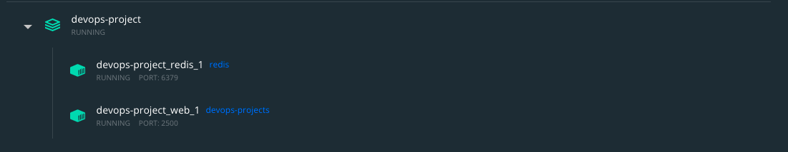
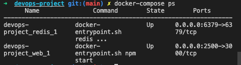
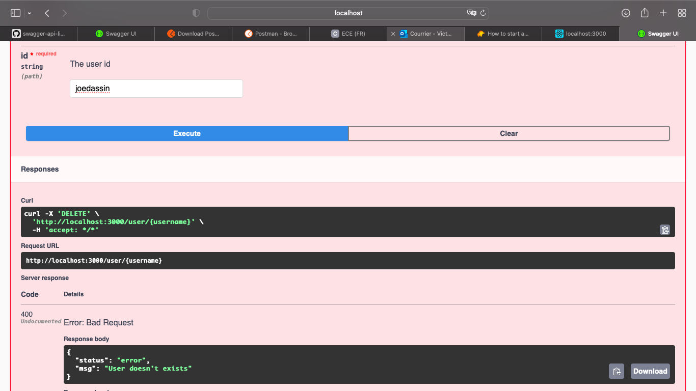

# DevOps project for Victor Barbe and Pierre-Louis gaucher. This README file will provide the explanations and instructions to run our project.

## Create a web application

To create a web application, we use the application for Lab 4 which we improved.

1. CRUD user functionality

We added the update and delete functionalities, which were not available at the start. They allow to modify the lastname and firstname of a user, and delete a user.

2. Storage

The application uses Redis to store the new users we can create, read, update or delete thanks to the CRUD user functionality.

3. Continuous-testing

The application was also supposed to use test. We implemented the missing tests for the update and delete functionalities, as well as the missing parts for the configuration.

4. Use the application

To use this application, we first have to install npm with `npm install`. Then to run it, we need to type `npm start` in the command line, and the web server will be available at http://localhost:3000 .

To run the test, we have to type in the command line `npm test`. The test will then confirm in the terminal that unit, API, configuration and connection are correct.

## Apply CI/CD pipeline

The goal of applying CI/CD is to allow our code to be deployed at any moment, while making the integration of new code in the project secure by testing it automatically on git actions.

1. Continuous integration

First to achieve continuous integration, we have to create a [`main.yml`](.github/workflows/main.yml) file contained in the `.github/workflows` folder. The main.yml fill will configure the parameters for the continuous inegration.

Then, when pushing our project on github, git action will automatically test our code following the jobs that were defined in the [`main.yml`](.github/workflows/main.yml).
.github/workflows/main.yml 2. Continuous developpement

To achieve continuous developpement, we are going to use heroku. First we need to create an heroku account, and get the API key to connect our secret to github. Then in the [`main.yml`](.github/workflows/main.yml) file, we need to precise our email to authentify, as well as the application name. The application name is a unique name we created on heroku using our account.

Now when we make a new commit, git action will automatically test using the CI part, and then if the test are passed the application is automatically deployed as we can see on git action:


The application is deployed using heroku: from our heroku account, we can click the `open app` button, and we will be redirected to the https://devops-projects.herokuapp.com link. Our application can now be automatically integrated and tested, and then automatically deployed using heroku.


## Configure and provision a virtual environment and run your application using the IaC approach

To use the IaC approach for our project, we need to create a Virtual Machine that will be configured using Vagrant. Then, we will provide the virtual Machine using Ansible. The files needed for IaC will be located in the [`iac`](iac) folder.

1. Creating a VM with Vagrant

To create a virtual machine on virtual Box using Vagrant, we will need a [`Vagrant file`](iac/Vagrantfile). This file will contain all the information needed to create our Virtual machine. We also need a [`Vagrant file`](iac/playbooks/run.yml).

2. Provisioning with ansible

## Build Docker image of your application

To build a docker image of our application, first we create the [`Dockerfile`](Dockerfile).
Then in a terminal, we navigate to the `devops-project` directory and run the following command:

```
docker build -t devops-projects.
```

This will build our docker image, base on the docker file in our directory. The `.` at the end of the commands tells Docker to look for the [`Dockerfile`](Dockerfile) in the current directory.

We can check if our Docker container appears in the local Docker images:

```
docker images
```

Now we run the container we just created with the following command:

```
docker run -p 12345:3000 -d devops-projects
```

-p maps a port on the local machine to a port inside the container
-d makes the container run in the background

Now, we can open your web browser and go to http://localhost:12345. We can see that the message `Hello World, this is Victor's and pl project!` is displayed, because it is now running in the container and not on VS-code like before !


Now we use the command `docker ps` to check if the container is running and to get its ID. Here the first container is the one we created right now, the other two bellow are the container created for the docker-compose part, which will take the image devops-projects we just created to create the orchestrated devops-project app.


Now we tag our container with the following command:

```
docker tag devops-projects barbevictor/devops-projects
```

Now we have to olg in to Docker Hub from the terminal with the command:

```
docker login
```

We can now push the docker image to Docker Hub with the following command:

```
docker push barbevictor/devops-projects
```

Now when we go to my repositories on the dockerhub, we can see that the image is visible.


It can now be retrived from an other computer using the command:

```
docker pull barbevictor/devops-projects
```

And it can be started using this command:

```
docker run -p 12345:3000 -d barbevictor/devops-projects
```

This now allows somebody to run our small CRUD application using Docker, without having it locally in his computer which was mandatory in the part 1 of our project.

## Make container orchestration using Docker Compose

Now, we can orchestrate our container using Docker Compose. To do so, we first create our [`Docker compose file`](docker-compose.yml). This file will containt all the information needed to use docker-compose.

Then in a terminal, we navigate to the `devops-project` directory where the Docker file and Docker-compose files are located and run the following command:

```
docker-compose up
```

We can see in the terminal that the containers for redis and the web are running correctly:


On our [`Docker compose file`](docker-compose.yml), we assigned the port 2500. Once the docker compose up command as been used, if we go to http://localhost:2500 we will have the message `Hello World, this is Victor's and pl project!`.


We can also see the new composed-container that is created on Docker, with a container for redis and one for the web part.



In our terminal we can run the command `docker-compose ps` to see the composed apps that are running. Here, there will be `devops-project_redis_1` and `devops-project_web_1`.



With this part, we orchestrated our container using compose. The Docker volume used in the [`Docker compose file`](docker-compose.yml) will allow use to keep data that might be modified, the Redis container stores its data in the `/data` directory.

Docker compose created two containers, one for the web part and the other for redis. This way, our containerized application can communicate with redis which is also containerized.

## Make docker orchestration using Kubernetes

Now we are going to orchestrate our containers using Kubernetes. We created a [`k8s`](k8s) folder containing all the needed files. Then, we will use `kompose`, a conversion tool. To do so, we need to install kompose on our computer, we can do so using the command `brew install kompose` among others.

Then, we need to navigate to our directory, in the root of the project were our docker-compose.yml file is located. We run the command `kompose convert`. This command will create 5 files, that we can then move to our [`k8s`](k8s) folder.

For the web part, we create 2 files: the [`web-service.yaml`](k8s/web-service.yaml), and the [`web-deployment.yaml`](k8s/web-deployment.yaml).

For the database part using redis, we created 2 files as well: [`redis-service.yaml`](k8s/redis-service.yaml) and [`redis-deployment.yaml`](k8s/redis-deployment.yaml).

Finally, we were asked to use a persitent volume for the kubernetes orchestration. To do so, we create a [`myvolume-persistentvolumeclaim.yaml`](k8s/myvolume-persistentvolumeclaim.yaml). The volume is called myvolume refering to the name we gave it in the [`Docker compose file`](docker-compose.yml) in the former part of the project.

Now to run our project, we first need to apply our configuration files. To do so, we start minikube using
`minikube start` in a terminal. Then to apply the manifest files, we run from [`k8s`](k8s) folder the command

```
kubectl apply -f .
```

This will create our 2 deployments, and the 2 services as well as the persitent volume. Now to access the web page created by our project that displays `Hello World, this is Victor's and pl project!`, we need to use the following command :

```
minikube service web
```

We get this output in the console.


We are redirected to our web browser on the URL generated above and get the `Hello World, this is Victor's and pl project!`.


Now to use the redis service, we use the same command:

```
minikube service redis
```

To use our persitent volume, we will need to use both our [`myvolume-persistentvolume.yaml`](k8s/myvolume-persistentvolume.yaml) and [`myvolume-persistentvolumeclaim.yaml`](k8s/myvolume-persistentvolumeclaim.yaml).

First, we need to apply our persitent volume using the following command:

```
kubectl apply -f myvolume-persistentvolume.yaml
```

Now we can also view the information about the persitent volume using this command:

```
kubectl get pv myvolume
```


We will get this output that tells us the PersistentVolume has a status of available, which means it has not yet been bound to a PersistentVolumeClaim.

Then we need to apply our [`myvolume-persistentvolumeclaim.yaml`](k8s/myvolume-persistentvolumeclaim.yaml)

```
kubectl apply -f myvolume-persistentvolumeclaim.yaml
```

We can now see that our PersitenVolumeClaim is created

```
kubectl apply get pvc
```

After we create the PersistentVolumeClaim, the Kubernetes control plane looks for a PersistentVolume that satisfies the claim's requirements. If the control plane finds a suitable PersistentVolume with the same StorageClass, it binds the claim to the volume.

Now if we look at the persitentvolumeclaim or the persistentvolume, it will have a status of Bond:

```
kubectl get pvc
kubectl get pv
```


The output shows that the PersistentVolumeClaim is bound to your PersistentVolume. So indeed we managed to create our persistentVolume here with the persistentVolumeClaim. Now we need to make the pod created by the redis deployment use this persistentVolume, so the data from our application is stored correctly. To do so, we precise the persitentvolumeclaim in the [`redis-deployment.yaml`](k8s/redis-deployment.yaml). As we linked the PVC to the PV, the pod created by the [`redis-deployment.yaml`](k8s/redis-deployment.yaml) will use our persistent volume.

We need to apply the web and redis deployment, which will both create one pod (because we scaled it this way in our deployment files)

```
kubectl apply -f redis-deployment.yaml
kubectl apply -f web-deployment.yaml
```

This will create two pods, that we can see using the command `kubectl get pods`:


We now managed to orchestrate using kubernetes, and to persist our data on a persistentVolume.

## Make a service mesh using Istio

## Implement Monitoring to your containerized application

## Bonus

1. Swagger UI

As a first bonus we decided to implement swagger UI. To do so, we first install the needed dependencies running

```
npm i express-swagger-generator --save-dev
npm install -g @apidevtools/swagger-cli
```

Now the needed dependencies are added in the [`package.json`](package.json).

Now we also need to modify both the [`src/index.js`](src/index.js). In this file we import the required const for swagger, and then we create the `const options` that will precise the correct url and the path to the route of [`src/routes/user.js`](src/routes/user.js) file.

Then in the [`src/routes/user.js`](src/routes/user.js) file, we need to implement the code needed for the documentation of the API : the delete, put, post and get functions.

Now when we run the project using `npm start`, we can either go to http://localhost:3000 to get the regular `Hello World, this is Victor's and pl project!`, or we can go to http://localhost:3000/api-docs to get the documentation using swagger. The documentation is composed of a part explaning the structure like this, here we can see that every user must have a username (that is used to identify each user), a firstname and a lastname.


Then in the upper part, there will be a section for each function of the application : create, delete, update or read a user. In this section, we can also check if every function works properly. As an example, we can try to add a new user and see if it works properly (I also checked on postman if every CRUD functionaliy works properly):


Here, we can see we added a new user with a username of `plgaucher`, firstname of `pierrelouis` and lastname of `gaucher`. It is added sucessfully.

We can also try the other functions, and we will get a message error if we try to delete a user that doesn't exist as an example we try to delete an user with the username `joedassin` that doesn't exit in the database:



2.Tests

For the application, we decided to make more unit test in the  folder to make sure the CI/CD part that is comming after ensure the deployment of a fully functionnal application each time a commit is done on github. To run the tests, we have to run in the terminal `npm test`. We will get this output:


We can see that there are test for each function of the routes and controller. For each function of the controller, we will verify that the function achives its purpose, that wrong user parameters arent passed, for the create user that we arent creating an existing user and for the other functions that the user exists.

For the user REST API, we verify that each function achieves its role and that users exists before getting modified, deleted or viewed.

ATTENTION VERIFIER README PAS DE PORT COMMENCANT PAR 0
